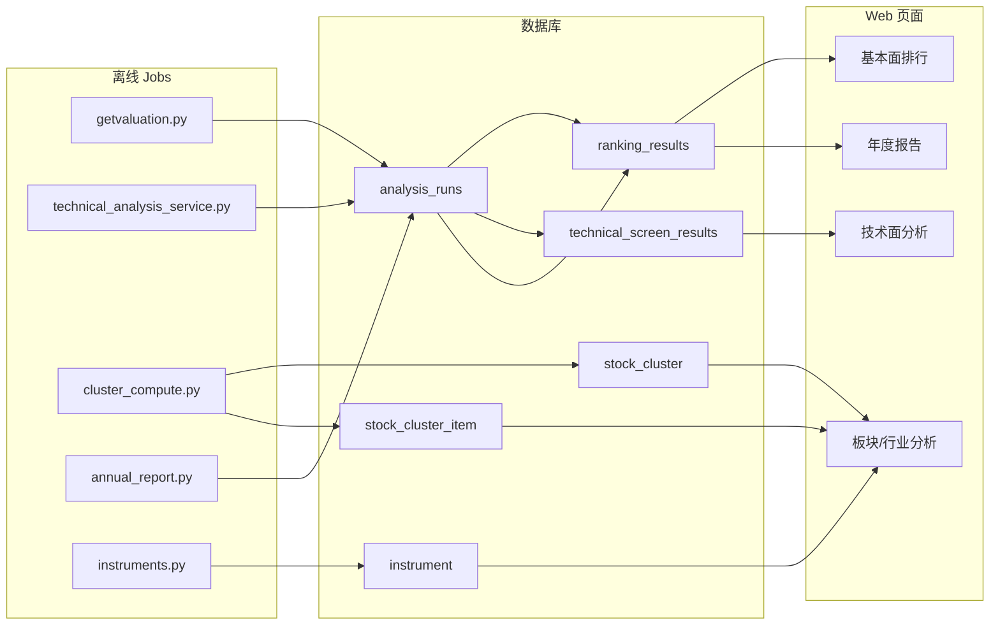

# 导航菜单页面数据来源说明

本文档说明 Web 导航菜单各页面从哪些数据表读取数据，以及这些数据由哪些离线脚本 / Pipeline 生成。

## 数据读取架构

Web 端默认从数据库读取已发布的分析结果（`READ_ANALYSIS_FROM_DB=True`）。CSV 文件仅作为可选镜像；本地开发可通过 `CSV_DEV_FALLBACK` 回退读取文件。

典型数据流：

```
离线脚本计算 → compute/publish.py 写入 DB → Web Service 读取 → 页面展示
```

统一日终入口：

- `bin/run_eod_jobs.sh` → `python -m compute eod_all`

`eod_all` 会依次执行 `daily_pipeline`、`ranking_pipeline`、`cluster_pipeline`，并在环境变量开启时执行 `annual_pipeline` 与 CSV→DB 同步。

---

## 一、基本面分析

| 菜单页面 | 路由 | 主要数据表 | result_key / 说明 | 生成脚本 / Pipeline |
|---------|------|-----------|-------------------|-------------------|
| 市盈率排行 | `/pe` | `analysis_runs` + `ranking_results` | `category=ranking`, `result_key=pe` | `jobs/ranking_pipeline.py` → `analysis/getvaluation.py` → `get_profit_report()` |
| 市净率排行 | `/pb` | 同上 | `result_key=pb` | 同上 |
| 净资产收益率排行 | `/roe` | 同上 | `result_key=roe` | 同上 |
| 现金股息率排行 | `/divi` | 同上 | `result_key=divi` | 同上 |

**Web 读取路径：**

- 路由：`app/stock/views.py` → `get_stock_ranking()`
- 服务：`app/services/ranking_service.py` → `get_ranking_rows_from_db()`

**上游依赖（计算时使用，页面不直接查询）：**

- 行情与分红数据：AkShare / tushare（`providers.market_registry`）
- 可选镜像 CSV：`stock_pe.csv`、`stock_pb.csv`、`stock_roe.csv`、`stock_dividence.csv`

---

## 二、技术面分析

| 菜单页面 | 路由 | 主要数据表 | result_key / 说明 | 生成脚本 / Pipeline |
|---------|------|-----------|-------------------|-------------------|
| 涨跌幅分析 | `/tech/filter` | `analysis_runs` + `technical_screen_results` | `category=price_change`, `result_key=price_change` | `jobs/daily_pipeline.py` → `analysis/technical_analysis_service.py` → `price_change_computer()` |
| 创历史新高 | `/tech/highest` | 同上 | `category=technical`, `result_key=highest` | `daily_pipeline` → `highest_in_history()` |
| 创历史新低 | `/tech/lowest` | 同上 | `result_key=lowest` | `daily_pipeline` → `lowest_in_history()` |
| 均线多头 | `/tech/ma_long` | 同上 | `result_key=ma_long` | `daily_pipeline` → `ma_long_history()` |
| 突破均线 | `/tech/break_ma` | 同上 | `result_key=break_ma` | `daily_pipeline` → `break_ma()` |
| 年线之上 | `/tech/above_ma` | 同上 | `result_key=above_ma` | `daily_pipeline` → `above_ma()` |

**Web 读取路径：**

- 路由：`app/technical_analysis/views.py`
- 服务：`app/services/technical_analysis_service.py` → `get_technical_rows()` / `get_price_change_rows()`

**上游依赖：**

- 日线数据：`jobs/daily_pipeline.py` → `analysis/history_data_service.py`（写入 `DAY_FILE_PATH` 或 `daily_bars` 表）
- 股票列表：`analysis/instruments.py` → `get_instrument_list()`（写入 `instrument` 表）
- 可选镜像 CSV：`price_change.csv`、`highest_in_history.csv`、`lowest_in_history.csv`、`ma_long.csv`、`break_ma.csv`、`above_ma.csv`

---

## 三、板块分析

| 菜单页面 | 路由 | 主要数据表 | section 字段 | 生成脚本 / Pipeline |
|---------|------|-----------|-------------|-------------------|
| 上证50 | `/cluster/sz50` | `stock_cluster` + `stock_cluster_item` | `section='sz50'` | `jobs/cluster_pipeline.py` → `analysis/cluster_compute.py` → `run_index_section('sz50', '000016')` |
| 沪深300 | `/cluster/hs300` | 同上 | `section='hs300'` | `run_index_section('hs300', '000300')` |
| 中证500 | `/cluster/zz500` | 同上 | `section='zz500'` | `run_index_section('zz500', '000905')` |
| 全部股票 | `/cluster/all` | 同上 | `section=<行业名>`（按行业聚类） | `cluster_compute.py` → `run_all_industry_sections()` |

**Web 读取路径：**

- 路由：`app/cluster_analysis/views.py` → 直接查询 `StockCluster` / `StockClusterItem`
- 「全部股票」页通过 `/industry/industries` 获取行业列表，再按行业名请求 `/cluster/<industry>/data`

**上游依赖：**

- 指数成分：AkShare `index_stock_cons`
- 价格序列：日线文件 / `day_data` 模块
- 行业聚类：`instrument` 表中的 pe、pb、esp 等基本面字段

---

## 四、行业分析

| 菜单页面 | 路由 | 主要数据表 | 说明 | 生成脚本 / Pipeline |
|---------|------|-----------|------|-------------------|
| 行业分析 | `/industry` | `instrument`（主数据）<br>`stock_cluster` + `stock_cluster_item`（聚类标签） | 行业列表来自 `instrument.industry`；聚类结果按行业名作为 `section` | `instrument`：`daily_pipeline` → `instruments.py`<br>聚类：`cluster_pipeline` → `run_industry_section()` |

**Web 读取路径：**

- 路由：`app/industry_analysis/views.py`
- 服务：`app/services/industry_cluster_service.py` → `get_industry_cluster_payload()` / `get_industry_stock_payload()`

**辅助接口：**

| 接口 | 数据表 |
|------|--------|
| `/industry/industries` | `instrument` |
| `/industry/data` | `instrument` + `stock_cluster` + `stock_cluster_item` |
| `/industry/stock/<code>` | 同上（同聚类内股票） |

---

## 五、年度报告

| 菜单页面 | 路由 | 主要数据表 | result_key / 说明 | 生成脚本 / Pipeline |
|---------|------|-----------|-------------------|-------------------|
| 2018（个股报告） | `/annual_report/2018`<br>`/annual_report_stock/<year>/...` | `analysis_runs` + `ranking_results` | `category=annual_stock`, `result_key=<year>` | `jobs/annual_pipeline.py` → `analysis/annual_report.py` → `compute()` |
| 2018（行业报告） | `/annual_report_industry/<year>/...` | 同上 | `category=annual_industry`, `result_key=<year>` | 同上 |

**Web 读取路径：**

- 路由：`app/annual_report/views.py`
- 服务：`app/services/annual_report_service.py`

**运行说明：**

- 默认不在 `eod_all` 中执行，需设置 `TW_RUN_ANNUAL_REPORT=1`，或单独运行 `python -m compute annual_pipeline`
- 报告年份由环境变量 `TW_ANNUAL_REPORT_YEAR` 控制
- 上游：日线数据 + `instrument` 行业信息
- 可选镜像 CSV：`annual_technique_report_{year}.csv`、`annual_industry_report_{year}.csv`

---

## 六、导航中其他页面

| 菜单页面 | 路由 | 主要数据表 | 生成脚本 |
|---------|------|-----------|---------|
| 精选股票 | `/business` | `analysis_runs` + `ranking_results`（`result_key=business`） | `ranking_pipeline` → `analysis/get_value_4_business.py` |
| 自选股 | `/selfselectedstock` | `self_selected_stock`（用户自选）<br>`instrument`（基本面展示）<br>`report`（财务图表） | 用户操作写入；`instrument` 由 `instruments.py` 更新；`report` 由 `bin/getfinancialreport.py` 等历史脚本维护 |

---

## Pipeline 与脚本对照

| Pipeline 命令 | 作用 | 涉及菜单 |
|--------------|------|---------|
| `python -m compute eod_all` | 日终全量任务（推荐） | 基本面、技术面、板块、行业 |
| `python -m compute daily_pipeline` | 下载日线 + 技术面筛选 + 涨跌幅 | 技术面分析 |
| `python -m compute ranking_pipeline` | 估值 / 股息 / ROE / PB / PE 排名 + 精选股票 | 基本面分析、精选股票 |
| `python -m compute cluster_pipeline` | 指数 / 行业聚类 | 板块分析、行业分析 |
| `python -m compute annual_pipeline` | 年度报告 | 年度报告 |
| `python -m compute import_results` | CSV → DB 回填（迁移辅助） | 所有已发布 CSV 结果 |

Shell 入口：`bin/run_eod_jobs.sh`

---

## 核心数据表说明

### `analysis_runs`

分析批次元数据，记录每次发布的结果类别、键名、截至日期与行数。

| 字段 | 说明 |
|------|------|
| `category` | 结果类别：`ranking` / `technical` / `price_change` / `annual_stock` / `annual_industry` |
| `result_key` | 结果键，如 `pe`、`highest`、`2018` |
| `as_of_date` | 数据截至日期 |
| `source_file` | 来源 CSV 文件名（如有） |

### `ranking_results`

基本面排名与年度报告结果行。`data` 字段为完整行 JSON。

### `technical_screen_results`

技术面筛选与涨跌幅分析结果行。`data` 字段为完整行 JSON。

### `stock_cluster` / `stock_cluster_item`

板块 / 行业聚类结果。`section` 区分指数板块（`sz50`、`hs300`、`zz500`）或行业名称。

### `instrument`

股票基础信息与基本面字段，供行业分析、聚类计算及自选股展示使用。

---

## 数据流关系图



---

## 相关代码索引

| 模块 | 路径 |
|------|------|
| 导航模板 | `app/templates/navigation.html` |
| 基本面排行视图 | `app/stock/views.py` |
| 技术面视图 | `app/technical_analysis/views.py` |
| 板块聚类视图 | `app/cluster_analysis/views.py` |
| 行业分析视图 | `app/industry_analysis/views.py` |
| 年度报告视图 | `app/annual_report/views.py` |
| 结果发布 | `compute/publish.py` |
| Artifact 契约 | `core/artifacts.py`、`docs/contracts/artifacts.md` |
| 日终 Pipeline | `jobs/eod_all.py`、`jobs/daily_pipeline.py`、`jobs/ranking_pipeline.py`、`jobs/cluster_pipeline.py`、`jobs/annual_pipeline.py` |

---

## 环境变量参考

| 变量 | 作用 |
|------|------|
| `READ_ANALYSIS_FROM_DB` | Web 是否从 DB 读取分析结果（默认开启） |
| `CSV_DEV_FALLBACK` | 本地开发 CSV 回退（默认关闭） |
| `TW_RUN_ANNUAL_REPORT` | `eod_all` 是否包含年度报告 |
| `TW_ANNUAL_REPORT_YEAR` | 年度报告年份 |
| `TW_SYNC_CSV_TO_DB` | `eod_all` 是否执行 CSV→DB 同步 |
| `TW_WRITE_RESULT_CSV` | 计算时是否同时写出 CSV 镜像 |
